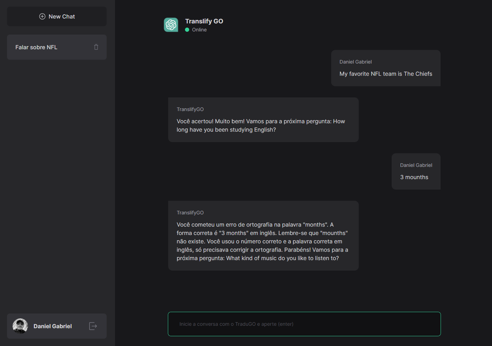

# Translify GO

  

-----------------------------------

Have you ever thought about practicing your English through natural conversation and being corrected every time you make a mistake? That was my project idea to improve my skills and seek opportunities in the market as a Developer.

To achieve this, I used the ChatGPT API to identify and dynamically correct errors. The technologies I used were MySQL, React Query, Next, Prisma, and Next Auth.

In the project, you start the chat by writing about the subject you want to talk about or even just any title. Then, you ask the first question or talk about yourself in English, and the chatbot will understand and continue the conversation, correcting your mistakes.

---

## Live Version

You can check the app in this link below [Translify GO - Website](https://translifygo.vercel.app/).

## Used Tools

This project uses the following tools:

- [Next.js](https://nextjs.org/)
- [Next Auth](https://next-auth.js.org/)
- [React Query](https://tanstack.com/query/v4/)
- [Prisma](https://www.prisma.io/)

## Contributing

To contribute to this project, please follow these guidelines:

1. Fork the repository
2. Create a new branch: `git checkout -b feature/your-feature-name`
3. Make your changes and commit them using Conventional Commits
4. Push to the branch: `git push origin feature/your-feature-name`
5. Submit a pull request

---

## License

This project is licensed under the MIT License - see the LICENSE.md file for details.

## Credits

This project was created by [Daniel Gabriel](https://github.com/revogabe).
